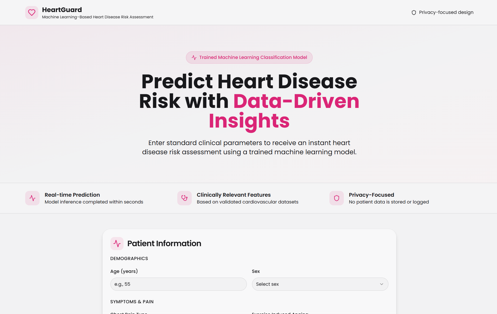
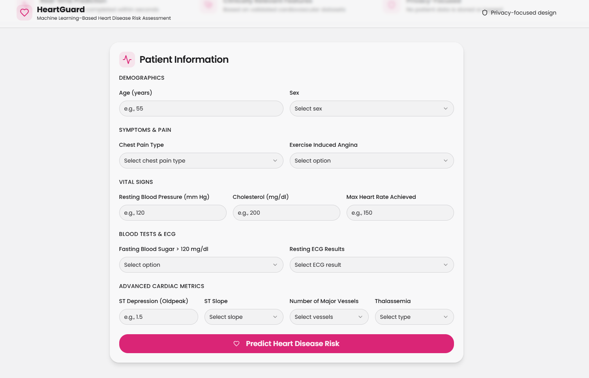
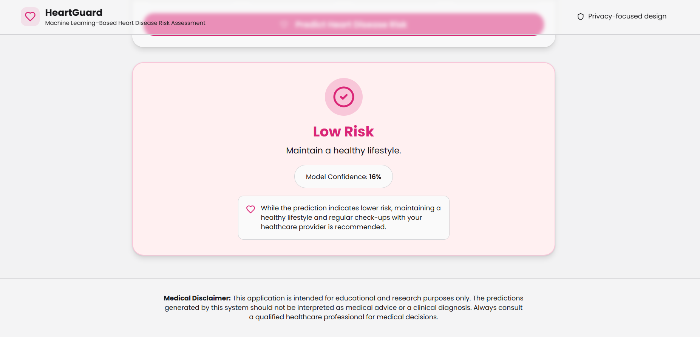

# ❤️ HeartGuard: Heart Disease Risk Assessment Tool

HeartGuard is a full-stack web application that estimates the risk of heart disease using standard clinical health parameters. It combines a machine learning classification model with a modern web interface to deliver fast, data-driven risk assessment.

> ⚠️ Disclaimer  
> This project is developed strictly for educational and academic purposes. It is not a medical diagnosis and must not be used as a substitute for professional medical advice.

---

## 📌 Problem Statement

Heart disease is one of the leading causes of mortality worldwide. Early identification of cardiovascular risk factors is essential for prevention and timely treatment. However, clinical data is often underutilized, manual analysis is time-consuming, and accessible early-stage risk assessment tools are limited. HeartGuard addresses this gap by providing a machine learning–based heart disease risk assessment system.

---

## 💡 Solution Overview

HeartGuard predicts whether a patient is at high or low risk of heart disease using clinical inputs such as age, blood pressure, cholesterol levels, ECG results, and exercise-related parameters. The system consists of a RESTful backend API serving the trained model and a React-based frontend for user interaction.

---

## 🏗️ System Architecture

Flow:
1. User enters clinical data through the web interface  
2. React frontend sends the data to the FastAPI backend  
3. Backend processes the input using a trained Random Forest model  
4. Prediction result is returned and displayed in real time  

---

## 🧠 Machine Learning Details

Problem Type: Binary Classification  
Target Variable: Presence of heart disease (Yes / No)  
Dataset: UCI-style Heart Disease clinical dataset  

Algorithms Evaluated:
- Logistic Regression  
- Naive Bayes  
- Support Vector Machine (SVM)  
- K-Nearest Neighbors (KNN)  
- Decision Tree  
- Random Forest  

Final Model:
- Algorithm: Random Forest Classifier  
- Accuracy: ~95%  
- Selection Reason: High accuracy, robustness, and stability on unseen data  

---

## 🖥️ Technology Stack

Frontend:
- React (Vite)
- TypeScript
- Tailwind CSS

Backend:
- FastAPI
- Python
- Scikit-learn

Deployment & Tools:
- Backend Hosting: Render
- Frontend Hosting: Render (Static Site)
- Version Control: Git & GitHub

---

## 🌐 Live Project Links

Frontend Demo:  
https://heartguard-frontend.onrender.com

Backend API (Swagger Docs):  
https://heart-disease-prediction-ec0f.onrender.com/docs

---

## 📝 Clinical Input Form

Users provide standard clinical parameters through a structured input form.

---

## 📊 Prediction Result

The system returns a clear risk assessment along with a confidence score and interpretive guidance.

---

## ▶️ How to Run Locally

Clone the repository:
git clone https://github.com/priyanshgolwalkar/heart-disease-prediction.git
cd heart-disease-prediction
Run backend:

cd backend
pip install -r requirements.txt
uvicorn app:app --reload
Backend will start at http://127.0.0.1:8000

Run frontend:

cd frontend
npm install
npm run dev
Open in browser at http://localhost:5173 (or the port shown in terminal)

## 📊 Input Parameters

Age: Age in years
Sex: 1 = Male, 0 = Female
Chest Pain Type (cp): 0–3
Resting Blood Pressure (trestbps): mm Hg
Serum Cholesterol (chol): mg/dl
Fasting Blood Sugar (fbs): >120 mg/dl (1 = true, 0 = false)
Resting ECG (restecg): 0, 1, 2
Maximum Heart Rate (thalach)
Exercise-Induced Angina (exang): 1 = yes, 0 = no
ST Depression (oldpeak)
Slope of ST Segment (slope): 0–2
Number of Major Vessels (ca): 0–3
Thalassemia (thal):
1 = Normal
2 = Fixed Defect
3 = Reversible Defect

## ✅ Output
Risk Level: High / Low
Confidence Score: Prediction probability
Interpretive Message: Contextual guidance

## 🎯 Key Highlights
End-to-end machine learning deployment
Clean separation of frontend and backend
Real-time prediction via REST API
Academic and interview-ready architecture

## 📌 Future Enhancements
Feature importance visualization
Explainable AI using SHAP
User analytics and prediction history
UI accessibility improvements
Model retraining with larger datasets

### 👤 Author
Priyansh Golwalkar
B.Tech Computer Science & Engineering
Academic Full-Stack Machine Learning Project

### 📄 License
This project is intended for educational use only. You are free to study, modify, and extend it for learning purposes.

## 📘 Note for Reviewers
This project demonstrates the practical integration of machine learning, backend API development, and frontend engineering in a healthcare-inspired real-world scenario.
